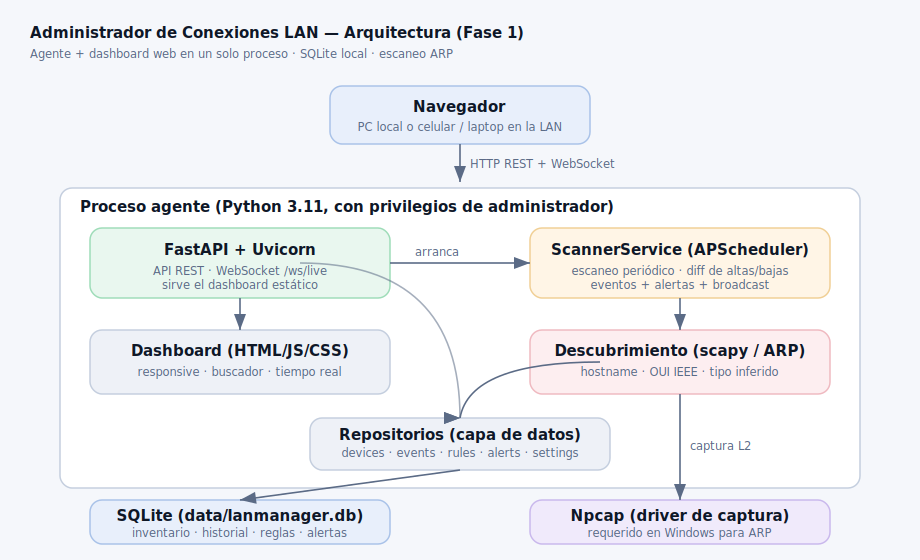

# Administrador de Conexiones LAN

[](https://github.com/StevenCarrilloLoor/Administrador-de-Conexiones-LAN/actions/workflows/tests.yml)

**Aplicación de administración de conexiones para una red local (Windows).**
Arquitectura de *agente + dashboard web*: un proceso nativo descubre y (en fases
siguientes) controla los dispositivos de tu red, y sirve un panel web accesible
desde la propia PC o desde cualquier dispositivo de la LAN.

> **Entrega actual: Fase 1 — Descubrimiento e inventario (MVP).**
> El control activo (bloqueo y límite de ancho de banda por ARP) corresponde a la
> Fase 2, y la seguridad/notificaciones a la Fase 3. Los endpoints de esas fases
> ya existen en la API pero responden `501 Not Implemented` de forma explícita —
> no se simula ninguna funcionalidad que todavía no está.

---

## 1. Qué hace la Fase 1

- **Escaneo ARP periódico** de todas las interfaces/subredes IPv4 activas.
- **Inventario de dispositivos**: IP, MAC, hostname (DNS inverso), **fabricante por
  OUI** (base IEEE real, offline, 35.084 prefijos) y **tipo inferido** (heurística).
- **Historial**: primera y última vez visto; eventos de conexión, desconexión y
  cambio de IP.
- **Etiquetado manual**: nombre personalizado y grupo por dispositivo (p. ej.
  "Notebook de Juan", grupo "familia").
- **Dashboard web en tiempo real** (WebSocket, sin refrescar), con **buscador** por
  IP/MAC/nombre/fabricante/grupo, filtros y diseño **responsive** (funciona en el
  celular).
- **Alertas** de dispositivo nuevo, y **API REST + WebSocket** documentada.
- **Manejo explícito de errores**: si falta Npcap o privilegios de administrador,
  la app lo detecta y lo explica; no falla en silencio.

---

## 2. Arquitectura



```
   Navegador (PC o celular en la LAN)
            │  HTTP + WebSocket
            ▼
   ┌─────────────────────────────────────────┐
   │  Proceso agente (Python, con privilegios)│
   │                                           │
   │   FastAPI + Uvicorn ── sirve ──► Dashboard│  (HTML/JS/CSS)
   │        │                                  │
   │        ├── ScannerService (APScheduler)   │
   │        │        │                         │
   │        │        ▼                         │
   │        │   Descubrimiento (scapy/ARP) ◄──── Npcap (driver)
   │        │                                  │
   │        └── Repositorios ──► SQLite (data) │
   └─────────────────────────────────────────┘
```

El **mismo proceso** expone la API, el WebSocket y el dashboard. El escaneo corre en
segundo plano (APScheduler) y difunde novedades por WebSocket. Todo el estado vive en
una base **SQLite** local. El diagrama editable está en
[`docs/architecture.drawio`](docs/architecture.drawio) (diagrams.net).

---

## 3. Requisitos previos

| Requisito | Detalle |
|---|---|
| **Windows** | 10 u 11 (x64). |
| **Python 3.11+** | https://www.python.org/downloads/ — marca *"Add Python to PATH"* al instalar. |
| **Npcap** | Driver de captura. Necesario para el escaneo ARP en Windows. Ver §4.2. |
| **Administrador** | El escaneo ARP requiere ejecutar el servidor como administrador. |

---

## 4. Instalación

### 4.1 Obtener el proyecto
Copia la carpeta del proyecto a tu disco (ya está en
`...\TRABAJOS GENERATIVOS\Administrador de Conexiones LAN\`).

### 4.2 Instalar Npcap (driver de captura)
1. Descarga el instalador desde **https://npcap.com/#download**.
2. Ejecútalo **como administrador**.
3. **Importante**: en las opciones del instalador, deja marcado
   **"Install Npcap in WinPcap API-compatible Mode"**. (La opción
   *"Support raw 802.11 traffic"* no es necesaria.)
4. Termina la instalación. No hace falta reiniciar en la mayoría de los casos.

> Sin Npcap, la API y el dashboard **igual arrancan**, pero el escaneo no
> encontrará dispositivos y la interfaz te avisará que falta el driver.

### 4.3 Instalar las dependencias
Haz **doble clic en `setup.bat`** (o ejecútalo desde una terminal). Crea el
entorno virtual `.venv` e instala todo. El resultado queda en `logs\setup.log`.

```
setup.bat
```

---

## 5. Uso

### 5.1 Iniciar el servidor y el dashboard
Para **escanear la red** necesitas privilegios de administrador:

- **Clic derecho en `run_server.bat` → "Ejecutar como administrador".**

Luego abre en el navegador: **http://localhost:8080/**

La API queda en `http://localhost:8080/api/status` y la documentación interactiva
(OpenAPI/Swagger) en `http://localhost:8080/docs`.

### 5.2 Inventario por consola (script de descubrimiento)
Para ver el inventario directamente en la consola (Entregable Fase 1 #2):

```
run_discovery.bat
```

Escanea una vez, imprime la tabla de dispositivos y guarda el resultado en la BD y
en `logs\discovery.log`. (También como administrador para resultados reales.)

### 5.3 Verificación end-to-end
Para comprobar que todo el stack funciona en tu equipo:

```
run_verify.bat
```

Ejercita la API, el dashboard y un escaneo real, y escribe `logs\verify.log`.

### 5.4 Acceder desde el celular / otra PC de la LAN
1. Ejecuta **`run_server_lan.bat`** (escucha en `0.0.0.0`).
2. Averigua la IP de esta PC con `ipconfig` (p. ej. `192.168.0.15`).
3. En el otro dispositivo abre `http://192.168.0.15:8080/`.
4. Si no carga, permite el puerto 8080 en el Firewall de Windows para redes privadas.

> ⚠️ **Seguridad**: en la Fase 1 el dashboard **no** tiene autenticación (llega en la
> Fase 3). Exponerlo en la LAN implica que cualquiera en la red puede verlo. Por eso
> el valor por defecto es `127.0.0.1` (solo esta PC).

---

## 6. Configuración

Copia `config.example.ini` a `config.ini` y ajústalo. Las variables de entorno
`LANMGR_*` tienen prioridad sobre el archivo.

| Sección | Clave | Por defecto | Descripción |
|---|---|---|---|
| server | `host` | `127.0.0.1` | `0.0.0.0` para exponer en la LAN (sin auth hasta Fase 3). |
| server | `port` | `8080` | Puerto del dashboard/API. |
| scan | `interval` | `30` | Segundos entre escaneos automáticos. |
| scan | `online_ttl` | `90` | Segundos para considerar a un equipo "en línea". |
| scan | `timeout` | `3.0` | Timeout del escaneo ARP por subred. |
| scan | `auto_scan` | `true` | Escanear automáticamente al iniciar. |

---

## 7. Estructura del proyecto

```
Administrador de Conexiones LAN/
├── agent/                 # Agente: descubrimiento y (futuro) control
│   ├── discovery.py       # escaneo ARP + enriquecimiento
│   ├── interfaces.py      # enumeración de subredes activas
│   ├── oui.py             # fabricante por OUI (IEEE, offline)
│   ├── device_type.py     # inferencia heurística de tipo
│   ├── platform_checks.py # detección de Npcap / administrador
│   ├── scanner_service.py # escaneo periódico + eventos/alertas
│   └── cli.py             # inventario por consola
├── api/                   # Backend FastAPI
│   ├── app.py             # app: rutas, WebSocket, dashboard estático
│   ├── config.py, logging_setup.py, models.py, ws.py
│   └── routers/           # devices, rules, alerts, network
├── dashboard/             # Frontend (HTML + JS + CSS, responsive)
├── db/                    # SQLite: esquema + repositorios
│   ├── schema.sql
│   ├── database.py
│   └── repositories.py
├── data/                  # oui.csv (IEEE) y la BD en runtime
├── docs/                  # diagrama de arquitectura
├── tools/verify_windows.py
├── main.py                # punto de entrada del servidor
├── requirements.txt
├── setup.bat / run_server.bat / run_server_lan.bat
├── run_discovery.bat / run_verify.bat
└── config.example.ini
```

---

## 8. API (estado en la Fase 1)

| Método | Ruta | Estado Fase 1 |
|---|---|---|
| GET | `/api/devices` | ✅ lista con estado actual |
| GET | `/api/devices/{id}` | ✅ detalle + historial |
| PATCH | `/api/devices/{id}` | ✅ renombrar / agrupar |
| POST | `/api/devices/{id}/block` | ⏳ 501 (Fase 2) |
| POST | `/api/devices/{id}/unblock` | ⏳ 501 (Fase 2) |
| POST | `/api/devices/{id}/limit` | ⏳ 501 (Fase 2) |
| DELETE | `/api/devices/{id}/limit` | ⏳ 501 (Fase 2) |
| GET / POST / DELETE | `/api/rules` | ✅ persistencia (enforcement: Fase 2) |
| GET | `/api/alerts`, POST `/api/alerts/{id}/ack` | ✅ |
| GET | `/api/network/scan` | ✅ fuerza un escaneo |
| GET | `/api/network/speedtest` | ⏳ 501 (Fase 3) |
| GET | `/api/status` | ✅ capacidades, contadores, límites |
| WS | `/ws/live` | ✅ altas/bajas y métricas en vivo |

---

## 9. Modelo de datos (SQLite)

Tablas: `devices`, `connection_events`, `rules`, `alerts`, `settings` — fiel al
modelo especificado, con dos extensiones documentadas en `devices`
(`device_type` para el tipo inferido, `is_random_mac` para MAC aleatoria) e índices
para rendimiento. El esquema completo está en [`db/schema.sql`](db/schema.sql).

---

## 10. Limitaciones técnicas (documentadas, no ocultas)

- Solo funciona contra dispositivos del **mismo segmento de red** (misma LAN/Wi-Fi);
  no cruza VLANs.
- No funciona si el router tiene **aislamiento de clientes** (AP client isolation).
- No funciona si el router usa **ARP estático** o **Dynamic ARP Inspection** (común
  en redes de oficina gestionadas).
- El bloqueo/límite (Fase 2) **deja de aplicarse** si esta PC se apaga, suspende o se
  cierra el proceso.
- El **antivirus/firewall** del dispositivo objetivo puede detectar el spoofing (es la
  misma técnica base que un ataque MITM).

Estas limitaciones también se muestran dentro del propio dashboard.

---

## 11. Solución de problemas

| Síntoma | Causa probable / solución |
|---|---|
| "Npcap NO detectado" | Instala Npcap (§4.2) en modo compatible con WinPcap. |
| "NO tiene privilegios de administrador" | Ejecuta `run_server.bat` con clic derecho → *Ejecutar como administrador*. |
| El escaneo no encuentra nada | Revisa Npcap + admin; confirma que estás conectado a la LAN; algunos Wi-Fi con *client isolation* no permiten ARP entre clientes. |
| No entro desde el celular | Usa `run_server_lan.bat` y abre el puerto 8080 en el Firewall (redes privadas). |
| La gráfica de fabricantes no aparece | Es opcional y necesita Chart.js; `setup.bat` intenta descargarlo para uso offline, o se toma del CDN si hay internet. El resto del panel funciona igual. |
| `python` no se reconoce | Reinstala Python marcando *"Add Python to PATH"*, o usa el lanzador `py`. |

Los registros quedan en `logs\app.log` (aplicación) y `logs\audit.log` (acciones
auditables, con marca de tiempo).

---

## 12. Autoarranque con Windows (opcional)

Para que el agente inicie con el sistema, crea una tarea en el **Programador de
tareas** de Windows que ejecute `run_server.bat` "con los privilegios más altos" al
iniciar sesión. (El ícono de bandeja y el empaquetado como servicio forman parte del
*empaquetado final*, ya disponible como `AdministradorLAN.exe`.)

---

## 12.bis Tests y CI

La suite de tests (pytest) cubre la API, los repositorios/BD, el versionado de
esquema, la resolución de fabricante por OUI, la inferencia de tipo, el servicio de
escaneo (con la red mockeada) y el bootstrap de Npcap. No requiere Npcap ni una LAN
real, así que corre en cualquier sistema y en CI.

```
pip install -r requirements.txt -r requirements-dev.txt
pytest -q
```

Cada `push` y cada `pull request` disparan el workflow de **GitHub Actions**
(`.github/workflows/tests.yml`), que corre la suite en Python 3.11, 3.12 y 3.13.

---

## 13. Uso responsable

Esta herramienta es **exclusivamente para redes propias o administradas con
autorización**. No incluye —ni debe incluir— funciones de evasión de detección,
ataque a redes ajenas, ni interceptación del contenido del tráfico ajeno más allá de
lo estrictamente necesario para aplicar bloqueo/límite (fases posteriores). El
escaneo de la Fase 1 es **pasivo/no intrusivo**: equivale a la lista de dispositivos
que muestra el panel de administración de tu propio router.

---

## 14. Roadmap

- **Fase 2 — Control activo**: bloqueo por ARP (instantáneo y permanente con
  reintento cada 1–2 s), límite de ancho de banda (WinDivert/`pydivert`), horarios
  (control parental), gráficas de consumo y grupos.
- **Fase 3 — Seguridad y notificaciones**: protección anti-spoofing del propio equipo,
  alertas de caída, notificaciones (Telegram/email/ntfy), Wake-on-LAN, test de
  velocidad, exportación CSV/JSON y **autenticación** del dashboard.

---

*Fase 1 · construido con Python 3.11, FastAPI, scapy y SQLite.*
